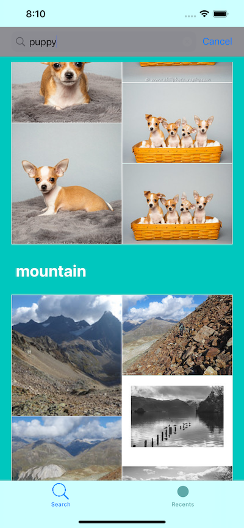

# Flickr Search

FlickrSearch is an iOS 15 sample app. It is a simple TabBar app that displays two UICollectionViews. Both of which use DiffableDataSources. The Search view uses a UISearchController to find photos on Flickr (you need to get a free Flickr api key to use). The DiffableDataSource is used to organize and group searches into sections where they are laid out using UICollectionViewCompositionalLayout for a design nicer than a simple flow. Async / await is used for the network download. Views are laid out using NSLayoutContraints programatically. The Recents tab displays the most recent photos from Flickr in a simple flow layout. Selecting a photo in either view displays it in it's own controller which lets you zoom in and out of the photo. Navigation is done using a simple instance of the Coordinator pattern (no, not the SwiftUI one).

## License

DigestSwiftUI is licensed under the Unlicense. See the LICENSE file for more information, but basically this is sample code and you can do whatever you want with it.
